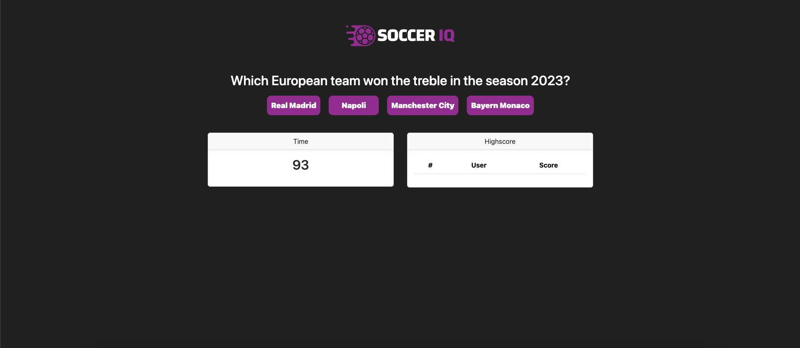
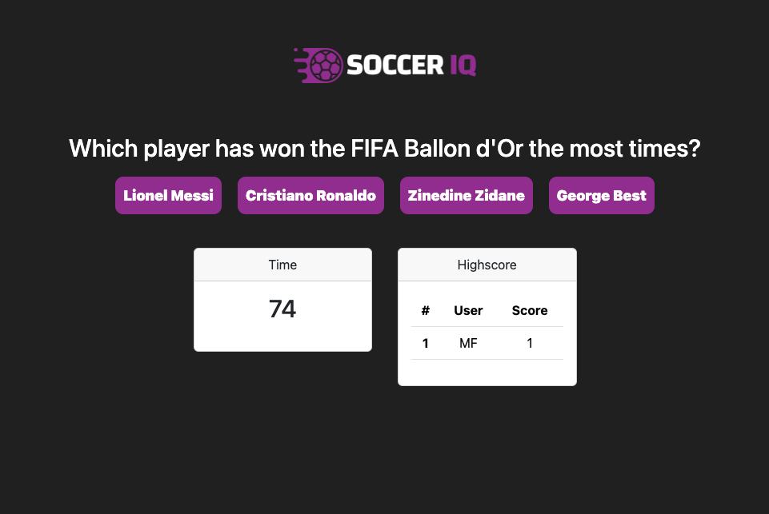
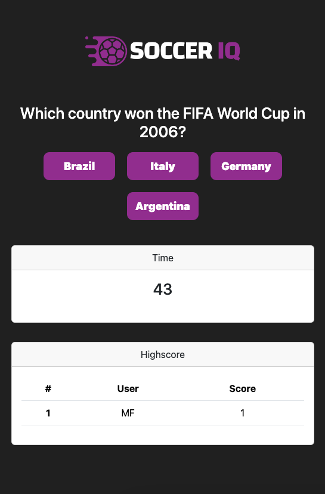

# Soccer IQ

## Project Description
Welcome to the Soccer's Premier Knowledge Quiz, where you can test and enhance your soccer knowledge! Challenge yourself with a series of soccer-related questions within a time limit and prove your Soccer IQ.

## How to Play
1. Click the "Start Quiz" button to begin your soccer knowledge journey.
2. Answer a series of questions about soccer within the given time limit.
3. Each correct answer adds to your score, while incorrect answers may penalize your time.
4. Complete the quiz and see your final score at the end.

## Mock-Up
The following image shows the web application's appearance on desktops' screen:

The following image shows the web application's appearance on tablets' screen:

The following image shows the web application's appearance on smartphones' screen:

## Credits
- [w3schools.com](https://www.w3schools.com/)
- [developer.mozilla.org](https://developer.mozilla.org/en-US/)
- [getbootstrap.com](https://getbootstrap.com/docs/5.3/getting-started/introduction/)
- [jquery.com](https://api.jquery.com/)

## Repository and Webpage link

- [Repository Link](https://github.com/marphco/soccer-iq)
- [Deployed Application Link](https://marphco.github.io/soccer-iq/)